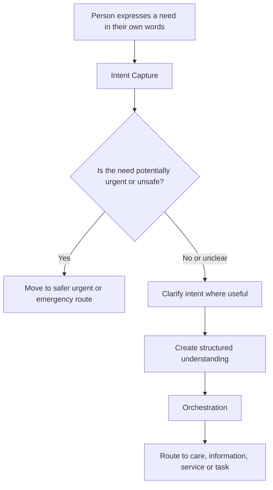
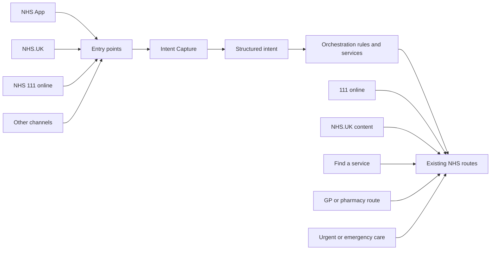

This page describes the emerging architecture view for AI Intent Capture. It is not a final technical architecture. It is a working model to support design, product, clinical safety and technical discussion.

Related pages:

- [Concepts](/concepts/) defines the core ideas used here.
- [Glossary and terminology history](/concepts/glossary/) gives shorter working definitions.

## Working architecture position

Intent Capture should be treated as a capability within a wider access, triage and navigation system.

It should help understand what a person is trying to do, express, resolve or understand, then support movement into an appropriate next step. It should not become a standalone destination or a replacement for existing clinical services.

## Simplified journey model

## Capability model

## What Intent Capture owns

Intent Capture should own:

- allowing people to express a need in their own words
- clarifying the need where that is useful and proportionate
- identifying when the interaction should stop or move to a safer route
- creating structured understanding that can support onward movement
- making clear what the service is and is not doing

## What Intent Capture should not own

Intent Capture should not own:

- final clinical assessment
- diagnosis
- clinical triage unless explicitly designed and assured for that purpose
- service availability decisions
- the whole user journey after handover
- the full orchestration layer

See [Intent Capture is not triage](/posts/2026-09-09-decisions-shaping-intent-capture/#intent-capture-is-not-triage) for the current scope boundary.

## Relationship to orchestration

Intent Capture can provide one input into orchestration. Orchestration is broader. It coordinates movement between services, channels, rules, pathways and responsibilities.

The same captured intent may need different routes depending on factors such as urgency, age, location, service availability, accessibility needs and whether the user is seeking help for themselves or someone else.

## Relationship to existing services

Intent Capture should work with existing NHS services rather than route around them.

It may move people towards:

- NHS 111 online
- NHS.UK health information
- services near the user
- account, appointment, prescription or record tasks
- urgent and emergency care routes
- other access, triage or navigation capabilities

## Design implications

This model creates several design implications:

- Handover points need to be visible and understandable.
- The service must not imply that AI is monitoring the user after handover.
- The structured intent model must be useful to downstream services.
- The user should be able to continue without AI where appropriate.
- The service needs clear stopping rules.

## Open architecture questions

- What information should be included in a structured intent object?
- Which services can receive structured intent safely and usefully?
- Where should orchestration rules live?
- How should clinical safety responsibilities be divided across the journey?
- How should the system handle ambiguity, conflicting signals or insufficient information?
- What should be logged for evaluation without over-collecting personal information?

Open questions should be recorded in relevant design history posts where they affect design or delivery choices.
